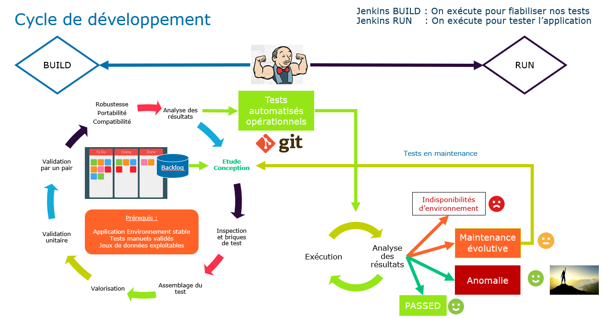

# Introduction

Ceci est un projet d'automatisation sur le site Demo Web Shop avec l'outil playwright

https://playwright.dev/

Comme tout projet de développement nous suivons les critères qualités TMAP sogeti ci dessous : 

- **Fonctionnalité** (functionality) répond au besoin de tests automatisés   
- **Maintenabilité** (maintainability) faire du : scripting structuré, page object model, locator de qualité  
- **Utilisabilité** (usability) organisation et convention de nommage dans code, documentation du README
- **Fiabilité** (reliability) point de synchro robuste, jeux de données maitrisés, points de contrôle (confiance du test) 
- **Performance** (performance) pas de temps d’attente en dur, optimisation algorithmique, parallélisation  
- **Portabilité** (portability) doit fonctionner sur n’importe quel poste Windows et sur le CI Linux 
- **Compatibilité** (compatibility) doit permettre de tester sur différents navigateurs/environnements  
- **Sécurité** (security) ne doit pas contenir des données sensibles comme un mot de passe admin

## L'application Demo Web Shop :

Fonctionnalité principales : 

- Authentification
- Recherche d'articles
- Panier d'achat
- Processus de paiement 

Environnement disponibles :
- https://demowebshop.tricentis.com/  --> QUALIF (version fonctionnelle du site mis en ligne)
 

 ## Ce projet contient les tests suivants  :

 A COMPLETER SOUS FORME DE TABLEAU 


 ## Ce projet propose les fonctionnalités suivantes  :
 - Lancement des tests par navigateur(chrome, firefox, safari)
 - Rapport de test au format html
 - Capture automatiques de l'écran en cas de failed
 - Possibilité de génération de vidéo 

 ## Structure principale  :

 - **pages** : les classes des pages objects models (locators)
 - **tests** : les tests(fichiers spec)
 - **playwright.config.ts** : fichier de configuration playwright
 - **packahe-lock.json** et **package.json** :  fichier projet npm
 - **.gitignore** : fichier de configuration git pour exclure node_modules et ce qui est relatif aux rapport de test

[Implémentation du Page du Page Object Model avec Playwright](https://playwright.dev/docs/pom)

Mettre un screen png de notre arboresence projet(exemple disponible dans les vidéos de cours playwright)


# Initialisation du projet

Créer un dossier(ex: formation-playwright) puis cloné le projet dans votre dossier avec la commande : 

```
git clone https://github.com/jernito/Demo-web-shop.git
```

**Le projet est validé avec les versions suivantes :**

- node : 21.0.0
- npm : 10.2.0

```
    "devDependencies": {
        "@playwright/test": "^1.44.1"
        "@types/node": "^20.12.12"
    }
```
https://www.npmjs.com/package/@playwright/test

**Pour l'IDE** : Utilisation de VS Code et des extension lié à playwright

- Nom: Playwright Test for VSCode
https://marketplace.visualstudio.com/items?itemName=ms-playwright.playwright

- Nom: Playwright Test Runner
https://marketplace.visualstudio.com/items?itemName=sakamoto66.vscode-playwright-test-runner

- Nom: Playwright Test Snippets
https://marketplace.visualstudio.com/items?itemName=mskelton.playwright-test-snippets

- Nom: Playwright Trace Viewer for VSCode
https://marketplace.visualstudio.com/items?itemName=ryanrosello-og.playwright-vscode-trace-viewer

**Pour rappel:**
Un projet npm contient les fichiers packages.json et package-lock.json qui figent les 
dépendances et leurs versions nécessaires au projet

Quand vous récupérer ce projet, le répertoire node_modules est absent
*normal on ne commite pas les binaires(les binaires font référence aux
 fichier exécutables et aux bibliotèques compilées ils souvent volumineux, et change souvent de version à chaque compilation) 
 et les résultats de tests sous git, ils sont précisés dans le fichier .gitignore*


On inclu tout ce qu'il y a à ignorer
```
node_modules/
/test-results/
/playwright-report/
/blob-report/
/playwright/.cache/
```
Pour recréer node_modules, tapez la commande ci dessous : 

```
npm clean-install
ou 
npm ci

Controlez que le répertoire node_modules à bien été créé

```
# Exécuter les tests  

**Rappel des commandes proposées lors de l'installation pour lancer les tests ou les outils**  

  


**La documentation** https://playwright.dev/docs/test-cli  

# Les rapports de test

La majorité des rapports sont activés dans le fichier de configuration playwright.config.ts  

https://playwright.dev/docs/test-reporters

```
  reporter: [
    ['html', { open: 'never', outputFolder: './test-results' }], // always, never and on-failure (default).
    ['line'],
    ['json', {  outputFolder: './test-results', outputFile: 'test-results.json' }],
    ['junit', { outputFolder: './test-results', outputFile: 'test-results.xml' }]
  ],
```

Si vous souhaitez, vous pouvez générer des rapport allure  
https://www.npmjs.com/package/allure-playwright 

# Gestion du projet d'automatisation

Ce projet de développement peut être réalisé en mode agile avec la méthode kanban (au fil de l'eau sans notion de sprint)

Avec une Definition Of Done (DOD) pour s'assurer du suivi du développement

Chaque US sera un test, les tests basés sur la même fonctionnalité seront développés en parallèle pour s'assurer au plus tôt que nos étapes communes (page object model) soit opérationnelles pour nos tests en cours de développement.


<div align="left">
  <br><br>  
</div>  

# Cycle de BUILD et de RUN  

<div align="left">
  <br><br>
</div>


# Intégration CI

**Pour l'intégration dans un CI tout est expliqué ici**

https://playwright.dev/docs/ci-intro  
https://playwright.dev/docs/ci  